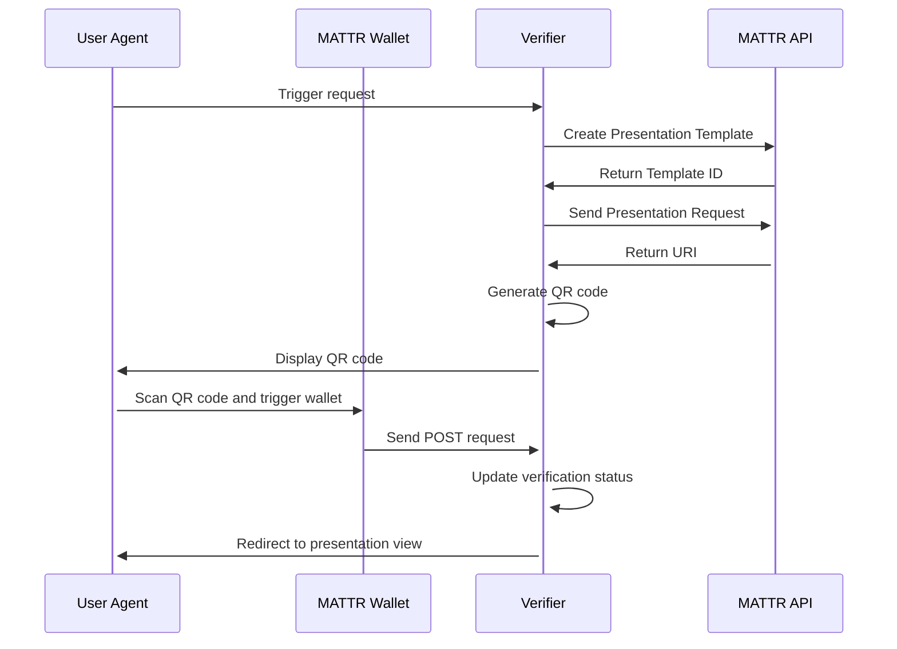

# MATTR Verifier

## **_The EU Verifier Branch can be found [here](https://github.com/felleslosninger/dc24-wallet-verifier/tree/eu-verifier-poc)._**

This is a simple application that demonstrates how a credential verifier would be able to request and recieve the credential of a user, using the MATTR API.

The application creates a `Request Template`, detailing what information the verifier needs from the user in order to function properly. 
Using that template, the verifier creates a `Presentation Request` which is converted to a QR code for the user to scan with their MATTR Showcase Wallet. 
The `Presentation Request` contains a callback URL which MATTR uses to send the credential to the verifier.
By hosting the application on `fly.io`, the verifier is able recieve credentials from MATTR, which is then displayed to the user.

The requested claims in the `Request Template` is based on the claims our [Issuer](https://github.com/felleslosninger/dc24-eu-wallet) recieves from Ansattporten.
For details on hosting the verifier on `fly.io`, see [our explanation](https://github.com/felleslosninger/dc24-wallet-verifier/?tab=readme-ov-file#flyio-setup) as well as their [official documentation](https://fly.io/docs/getting-started/).
  
## To run application
Copy the `.env.example` file, and then rename it to `.env`. Change the secrets in the `.env` file to your values.

The MATTR secrets can be obtained by requesting access to their API and following their [guide](https://learn.mattr.global/guides/) for setting up a verifier, as well as their [API documentation](https://learn.mattr.global/api-reference/).

## Fly.io Setup
- If you haven't already installed fly on your computer run the following command in your terminal:
`powershell -Command "iwr https://fly.io/install.ps1 -useb | iex"`
- Update the `fly.toml.example` file with secrets specified there and give your app a fitting name, e.g "johns-verifier". Make sure that someone else hasn't deployed an app with the same name to avoid that you overrun someone elses deployed app. (This is because the DC24 team is using the same organization sub)
- Before you deploy your app to fly.io you have to install Docker. Make sure that the Docker application is up and running and run the following command in your terminal from the directory to create a Docker image:
`docker build -f Dockerfile.jvm -t my-spring-boot-app .`
- You can now ship your Docker image launch your app by running `fly launch` from the terminal
- You will be asked if you want to use the existing fly.toml file, say yes.
- You will also be asked if you want to tweak the default settings, say yes. You will then be redirected to a settings page, here you must make sure that the organization you're using is "dc24" -> "Confirm Settings"
- You can now visit your by following the link printed in the terminal!
- To deploy changes to your up and running app you can run the same command you did to create a Docker image followed by `fly deploy --local-only`

## Presentation Flow

## Endpoints
### Default Endpoint

- _Method_: GET
- _URL_: http://localhost:2001/

A default endpoint serving as the verifier's homepage, containing a button which redirects the user to the QR code. If a QR code does not already exist in `/resources/static/qrCodes/`, the application first generates a QR code before redirecting the user.

### QR Code Endpoint

- _Method_: GET
- _URL_: http://localhost:2001/qr-code

An endpoint serving the QR code stored in `/resources/static/qrCodes/`. The QR code can be scanned by the MATTR Showcase Wallet, causing a `Selective Disclosure` `Presentation` to appear in the wallet asking for credentials. In order for the verifier to request correct information, ensure that the credential details requested in the `Request Template` are present in your `Verifiable Credential`.

If no QR code is present in the `qrCodes/` folder, it is generated the first time this endpoint is accessed. If the page fails to find the QR code image, relaunching the application fixes this issue, as the application struggles to access files generated while the program is running (non pre-generated files).

### Callback Endpoint

- _Method_: POST
- _URL_: http://localhost:2001/callback

An endpoint for MATTR to Post the user's credentials to. In order for MATTR to be able to access this URL it has to be included in the `Presentation Request`. When recieving a POST request, the verifier sets `hasReceivedVP` to `true`, as this would mean MATTR has been able to send a request to the callback URL.

### Verification Status Endpoint

- _Method_: GET
- _URL_: http://localhost:2001/verification-status

An endpoint which checks the status of `hasReceivedVP`, which gets updated in the [Callback Endpoint](https://github.com/felleslosninger/dc24-wallet-verifier/?tab=readme-ov-file#callback-endpoint). As the user's browser is still at the [QR Code Endpoint](https://github.com/felleslosninger/dc24-wallet-verifier/?tab=readme-ov-file#qr-code-endpoint) after scanning the QR code, the html has javascript code that polls this endpoint, checking if `hasReceivedVP` is true. If so the javascript redirects to the [Presentation View Endpoint](https://github.com/felleslosninger/dc24-wallet-verifier/?tab=readme-ov-file#presentation-view-endpoint)

### Presentation View Endpoint

- _Method_: GET
- _URL_: http://localhost:2001/presentation-view

Simple endpoint that displays the information retrieved from the user's credential.
